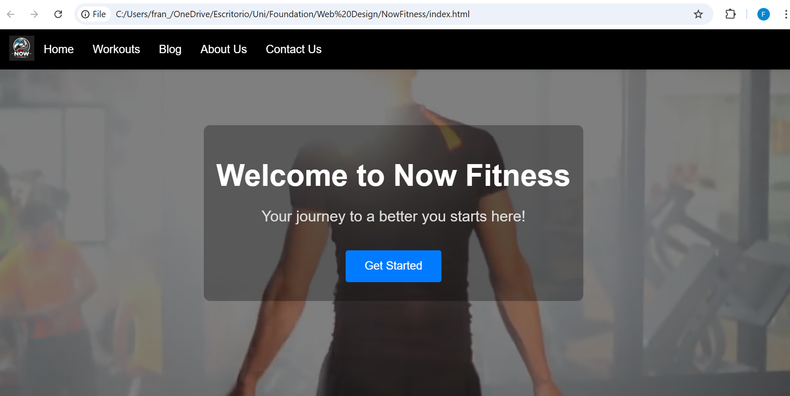
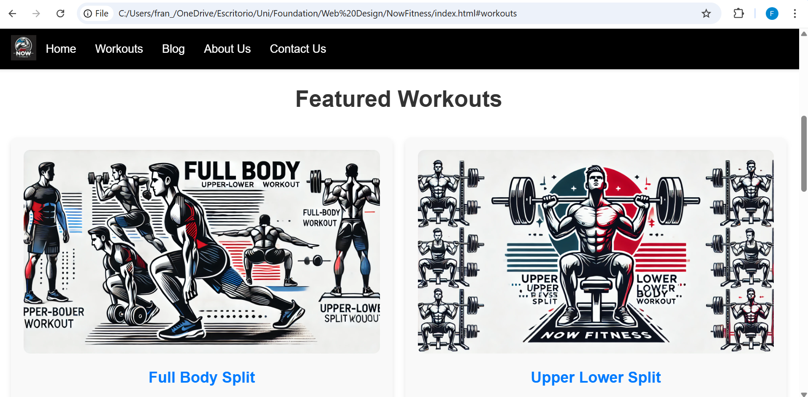
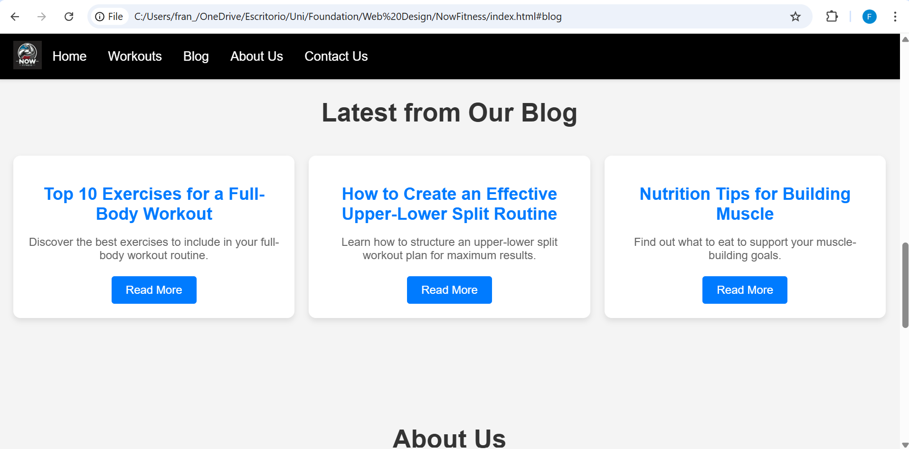
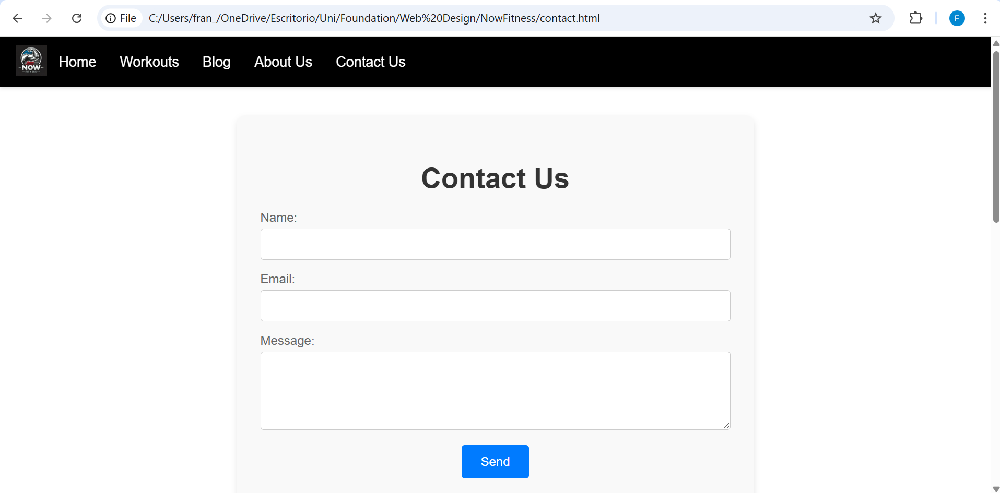

# Now Fitness - Responsive Fitness Website

A professional multi-page fitness website showcasing responsive design principles. Built as part of University of Greenwich Web Design coursework, demonstrating proficiency in HTML5, CSS3, and JavaScript fundamentals.



## Features

- **Fully Responsive Design**: Seamless experience across desktop, tablet, and mobile devices
- **5 Complete Pages**: Home, Workouts, Blog, About Us, Contact
- **Interactive Navigation**: Mobile-friendly hamburger menu with smooth scrolling
- **Contact Form**: Client-side validation with visual feedback
- **Embedded Map**: Google Maps integration for location display
- **Video Background**: Auto-playing hero section with overlay
- **Modern UI**: Card-based layouts, hover effects, smooth transitions

## Pages Overview

### Home Page
Hero section with video background, featured workouts preview, blog highlights, and company information.



### Workouts
Showcase of workout programs with visual cards:
- Full Body Split (beginner-friendly)
- Upper-Lower Split (intermediate level)

### Blog


Content cards linking to fitness articles:
- Top 10 Full-Body Exercises
- Creating Upper-Lower Split Routines  
- Nutrition Tips for Muscle Building

### Contact Page


Functional contact form with:
- Real-time validation
- Error messaging
- Success confirmation
- Embedded Google Maps

## Tech Stack

**Frontend:**
- HTML5 (semantic markup, accessibility features)
- CSS3 (Flexbox, Grid, custom properties, media queries)
- Vanilla JavaScript (form validation, mobile menu)

**Libraries & APIs:**
- Google Maps Embed API
- Custom responsive navigation

**Design Principles:**
- Mobile-first approach
- Modular CSS architecture (separate files per component)
- Accessible form labels and ARIA attributes

## Project Structure
```
NowFitness/
├── index.html          # Main homepage
├── contact.html        # Contact page
├── javascript.js       # Form validation & navigation
├── css/
│   ├── base.css       # Global styles, buttons
│   ├── header.css     # Navigation bar
│   ├── hero.css       # Hero section with video
│   ├── workouts.css   # Workout cards layout
│   ├── blog.css       # Blog grid styling
│   ├── about.css      # About section
│   ├── footer.css     # Footer with social links
│   ├── contact.css    # Contact form styles
│   └── media.css      # Responsive breakpoints
├── images/            # Logo, workout images, social icons
├── videos/            # Hero background video
└── screenshots/       # README documentation
```

## How to View

**Option 1: Local**
1. Download/clone the repository
2. Open `index.html` in any modern browser
3. Navigate between pages using the menu

**Option 2: GitHub Pages** (if deployed)
Visit: `https://franng95.github.io/NowFitness`

## Key Features Demonstrated

### Responsive Design
- CSS Grid for flexible layouts
- Flexbox for component alignment  
- Media queries for mobile (<768px)
- Hamburger menu for small screens

### Form Validation (JavaScript)
```javascript
// Email validation regex
if (!/\S+@\S+\.\S+/.test(email)) {
    messageContent.textContent = 'Please enter a valid email address.';
}
```

### Smooth Scrolling Navigation
```css
html {
    scroll-behavior: smooth;
}
```

### Hover Effects
All interactive elements include:
- Color transitions
- Scale transforms
- Box shadow changes

## What I Learned

**HTML/CSS:**
- Building semantic, accessible markup
- Creating reusable CSS components
- Implementing responsive design patterns
- Managing multiple stylesheets efficiently

**JavaScript:**
- DOM manipulation and event handling
- Form validation and user feedback
- Conditional logic for error states

**Design:**
- Visual hierarchy and spacing
- Color theory and contrast
- Mobile-first workflow
- User experience principles

## Browser Compatibility

Tested and working on:
- Chrome 90+
- Firefox 88+
- Safari 14+
- Edge 90+

## Future Enhancements

- [ ] Backend integration (Node.js/Express)
- [ ] Database for workout plans (MongoDB)
- [ ] User authentication and profiles
- [ ] Workout tracking functionality
- [ ] Payment integration for premium plans
- [ ] Blog CMS for dynamic content
- [ ] Video tutorials library
- [ ] Progress photos upload feature

## Deployment Options

Can be deployed to:
- **GitHub Pages** (static hosting)
- **Netlify** (automatic builds from Git)
- **Vercel** (with serverless functions)
- **Traditional hosting** (cPanel, FTP upload)

## License

Academic project - University of Greenwich Web Design coursework (2023)

## Contact

Francisco Navarro  
Email: frannavarrogil@gmail.com  
GitHub: [@franng95](https://github.com/franng95)  
LinkedIn: [franjng](https://linkedin.com/in/franjng)

---

**Note**: This is a static demo site. Contact form submissions are validated client-side but not sent to a backend. Map location and contact details are fictional examples.